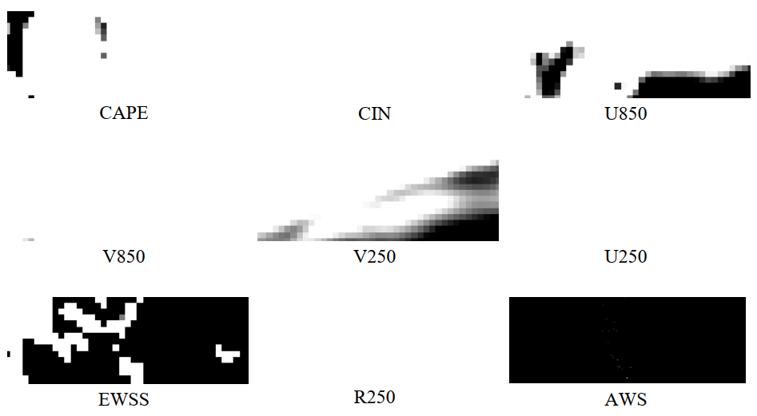
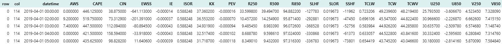
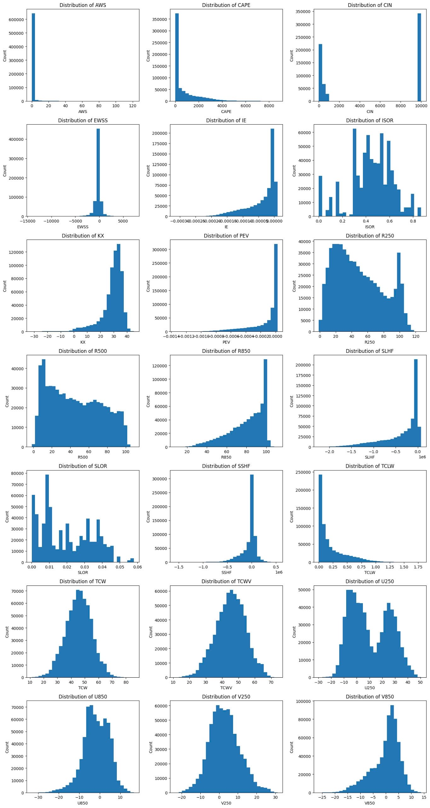
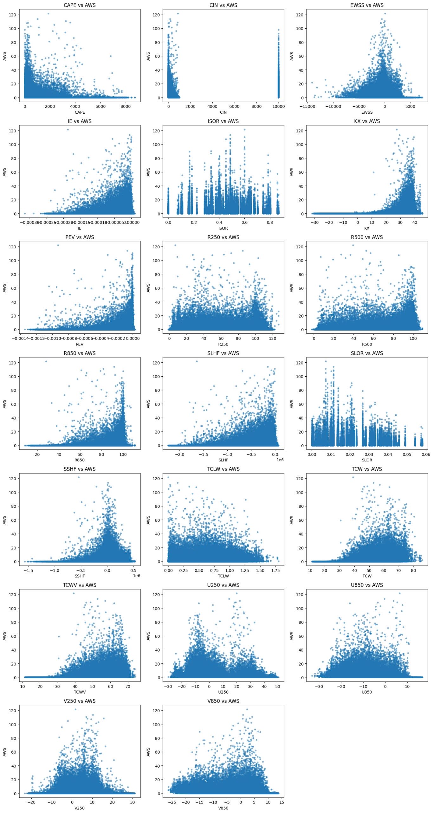
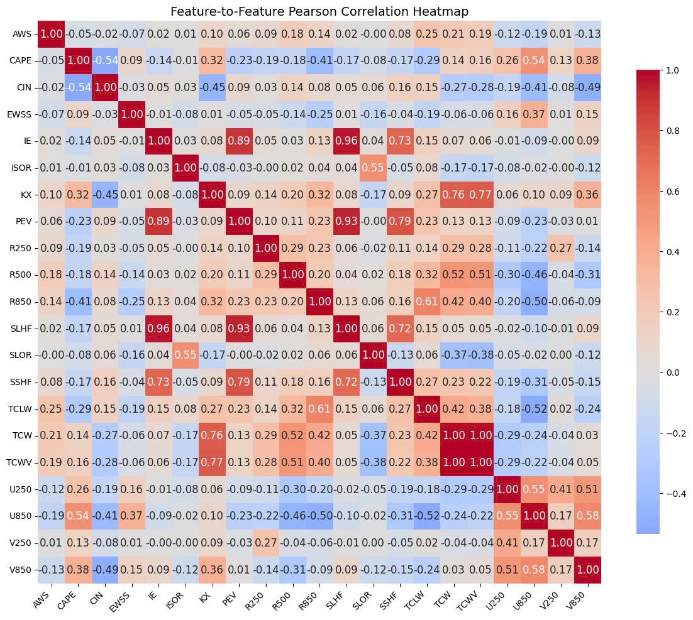
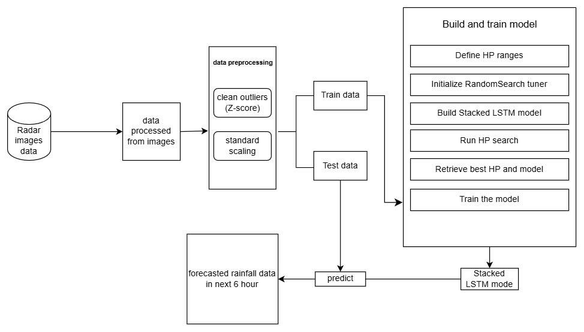
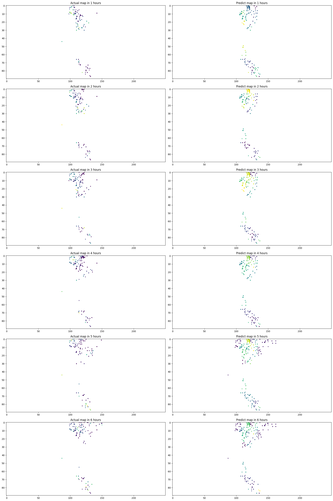

## Table of Contents

1. [Executive Summary](#1-executive-summary)
2. [Reference Paper](#2-reference-paper)

   1. [Summary of the Reference Paper](#21-summary-of-the-reference-paper)

      1. [Overview](#211-overview)
      2. [Objectives of the Paper](#212-objectives-of-the-paper)
   2. [Models Studied](#22-models-studied)

      1. [LSTM and Variants](#221-lstm-and-variants)
      2. [XGBoost](#222-xgboost)
      3. [AutoML (TPOT)](#223-automl-tpot)
   3. [Results of the Paper](#23-results-of-the-paper)
   4. [How the Team Applied It to Their Project](#24-how-the-team-applied-it-to-their-project)
3. [Data](#3-data)

   1. [Input Data Description](#31-input-data-description)
   2. [Processing Input Data into Tabular Format](#32-processing-input-data-into-tabular-format)

      1. [Data Collection](#321-data-collection)
      2. [Raw Data Processing](#322-raw-data-processing)
      3. [Output Data of the Step](#323-output-data-of-the-step)
   3. [Preliminary Analysis](#33-preliminary-analysis)
   4. [Feature Extraction](#34-feature-extraction)

      1. [Creating New Features](#341-creating-new-features)
      2. [Data Preprocessing](#342-data-preprocessing)
      3. [Selecting Relevant Variables](#343-selecting-relevant-variables)
4. [Methodology](#4-methodology)

   1. [Data Splitting](#41-data-splitting)
   2. [Model Selection](#42-model-selection)
   3. [Hyperparameter Tuning](#43-hyperparameter-tuning)

      1. [RandomizedSearchCV Method](#431-randomizedsearchcv-method)
      2. [Hyperparameters Used and Tuned in Prediction Models](#432-hyperparameters-used-and-tuned-in-prediction-models)
   4. [Model Evaluation](#44-model-evaluation)
5. [Experiments](#5-experiments)

   1. [Evaluation Metrics Results on Training Set](#51-evaluation-metrics-results-on-training-set)
   2. [Interpretation and Model Selection](#52-interpretation-and-model-selection)
6. [Rainfall Prediction and Mapping](#6-rainfall-prediction-and-mapping)

---

## 1. Executive Summary

This report focuses on short-term rainfall forecasting for the next 6 hours using station AWS data and ERA5 meteorological data from April and October of 2019 and 2020. Predictions are made using machine learning and deep learning models including XGBoost, Lasso, Ridge, and LSTM. Performance is evaluated using MSE, MAE, R², and Pearson correlation.

## 2. Reference Paper

### 2.1. Summary of the Reference Paper

#### 2.1.1. Overview

**Rainfall prediction: A comparative analysis of modern machine learning algorithms for time-series forecasting.**

This study evaluates and compares the performance of modern machine learning models in short-term rainfall forecasting. It uses hourly weather data from five UK cities between 2000 and 2020, including features such as temperature, humidity, pressure, wind speed, and precipitation. A multi-output forecasting strategy is applied, data are normalized with MinMaxScaler, and both deep learning and traditional ensemble models are compared to identify suitable methods for time-series rainfall prediction.

#### 2.1.2. Objectives of the Paper

* Compare the performance of deep learning models (LSTM and its variants) with traditional machine learning models (XGBoost, AutoML) in time-series regression for rainfall prediction.
* Provide analysis based on real meteorological data from five major UK cities across different periods.
* Identify the most appropriate model for practical rainfall forecasting applications.

### 2.2. Models Studied

#### 2.2.1. LSTM and Variants

* **Standard LSTM**: A simple, easy-to-implement model.
* **Stacked LSTM**: A deeper model that captures complex patterns, suitable for large datasets.
* **Bidirectional LSTM**: Learns information from both past and future time steps, enhancing contextual modeling.

#### 2.2.2. XGBoost

A powerful gradient boosting model used as a traditional baseline. It offers fast training and strong performance on tabular data.

#### 2.2.3. AutoML (TPOT)

* Employs genetic programming to automatically search for the best pipeline, including models like Extra Trees, Gradient Boosting, and SVR.
* Streamlines both model selection and hyperparameter optimization.

### 2.3. Results of the Paper

* Stacked LSTM and Standard LSTM achieved the lowest RMSE across most cities, demonstrating superior time-series modeling compared to XGBoost.
* XGBoost performed consistently but did not surpass LSTM in RMSE.
* AutoML (TPOT) yielded competitive results, particularly in cities with complex variability.

**Conclusion**

* Stacked-LSTM is the strongest choice for short-term rainfall forecasting.
* XGBoost serves as a solid baseline, but deep learning offers higher accuracy for short-term predictions.
* AutoML is a viable option for reducing manual model-building efforts.

### 2.4. How the Team Applied It to Their Project

Based on the reference paper, our team adopted the following core techniques:

* **Sliding Window Strategy**: Creates input sequences allowing models to learn temporal dynamics (e.g., humidity trends, wind speed changes, atmospheric instability) prior to rainfall. Continuity checks (1-hour intervals) were applied to remove incomplete sequences, ensuring data quality.
* **Model Implementation**: We built XGBoost and Stacked-LSTM models. Following a comparative analysis, we selected Stacked-LSTM and XGBoost as top performers and implemented custom enhancements to improve forecast accuracy.

## 3. Data

### 3.1. Input Data Description

* **Source**: Observation stations.
* **Format**: GeoTIFF (.tif).
* **Image size**: 90×250 pixels.
* **Temporal resolution**: 1 hour.
* **Spatial resolution**: 4 km.
* **Time periods**: April 2019, October 2019, April 2020, October 2020.
* **Measurements**: Recorded rainfall at station locations over time.

### 3.2. Processing Input Data into Tabular Format

#### 3.2.1. Data Collection

* **ERA5 Meteorological Data**: Key variables such as CAPE & CIN (convective potential), EWSS & KX (wind shear), R250 – R500 – R850 (humidity at different atmospheric levels) were used to model factors affecting rainfall.
* **AWS Precipitation Data**: Provides temperature, pressure, humidity, and other meteorological indices at station locations.
* Points with values ≥ 0: valid station measurements.
* White pixels (-inf, nan, or -9999): missing data locations.

*Example of raw precipitation data at 00:00:00 01/04/2020.*

#### 3.2.2. Raw Data Processing

* **Identify Valid Coordinates**:

  * Iterate through AWS files by year, month, day, and hour.
  * Verify the existence of the corresponding GeoTIFF file.
  * Read data using `rioxarray`.
  * Filter out invalid values (-inf).
  * Record valid coordinates.
* **Extract Data from GeoTIFF**:

  * Construct file paths by timestamp, location, and data type (AWS or ERA5).
  * Check file availability.
  * Open files and extract data at recorded coordinates.
  * Remove values of -inf, inf, and NaN.
  * Append data chronologically.
* **Aggregate into DataFrame**:

  * Combine data from all four time periods.
  * Convert to pandas DataFrame.
  * Save as CSV.
git
#### 3.2.3. Output Data of the Step

* Illustration of the processed table:

* **Columns**:

  * `row`, `column`: grid coordinates.
  * `datetime`: timestamp.
  * AWS, CAPE, CIN, …: meteorological variables and precipitation values.
* **Statistics**:

  * Total samples: 657,681.
  * Number of columns: 23.

### 3.3. Preliminary Analysis

Before modeling, exploratory techniques such as distribution plots, correlation heatmaps, and boxplots were used to identify trends, outliers, and variable relationships.

The distribution of variables shows that CIN has many outliers; the target precipitation has a right-skewed distribution, concentrated at low rainfall values (<10mm), indicating potential output imbalance. Thus, outlier removal and normalization were applied prior to modeling.

Subsequently, Pearson correlation between AWS precipitation and other variables was examined using scatter plots and heatmaps.

### 3.4. Feature Extraction

#### 3.4.1. Creating New Features

From the `datetime` column (`yyyy-mm-dd hh:mm:ss`), four cyclic features were generated: `hour_sin`, `hour_cos`, `doy_sin`, and `doy_cos` to capture daily and annual periodicity.

#### 3.4.2. Data Preprocessing

* **Outlier Removal**: Samples with z-score > 3 or < -3 were discarded.
* **Normalization**: Applied `StandardScaler` on the training set and used the same parameters for the test set to prevent data leakage.
* **Sliding Window Sequence**:

  * `window_size = 1` hour.
  * `horizon = 6` hours ahead.
  * Ensured temporal continuity with 1-hour gaps.

#### 3.4.3. Selecting Relevant Variables

Feature importance from a Random Forest model guided variable selection. Columns `row`, `column`, and `datetime` were dropped. Retained features: AWS (target), CAPE, CIN, V850, KX, R250, V250, U250, U850, EWSS.

| Feature     | Description                                     |
| ----------- | ----------------------------------------------- |
| CAPE        | Convective Available Potential Energy           |
| CIN         | Convective Inhibition                           |
| V850 & U850 | Wind components at 850 hPa                      |
| U250 & V250 | Wind components at 250 hPa                      |
| R250        | Humidity at 250 hPa                             |
| KX          | Combined humidity-temperature instability index |
| EWSS        | Vertical wind shear indicator                   |

## 4. Methodology

### 4.1. Data Splitting

* **Training Set**: 00:00:00 01/04/2019 to 23:00:00 15/10/2020.
* **Test Set**: From 00:00:00 16/10/2020 onward.

### 4.2. Model Selection

Five models were evaluated: Lasso, Ridge, Random Forest, XGBoost, and Stacked-LSTM.

* **Lasso**: L1 regularization for feature selection.
* **Ridge**: L2 regularization.
* **Random Forest**: Non-linear ensemble robust to outliers.
* **XGBoost**: Gradient boosting with built-in handling for missing data and regularization.
* **Stacked-LSTM**: Two-layer LSTM with Dropout, BatchNormalization, and Dense output.

*Stacked-LSTM model architecture.*

### 4.3. Hyperparameter Tuning

#### 4.3.1. RandomizedSearchCV Method

Randomized search over parameter distributions to efficiently explore hyperparameter space, suitable for complex models.

#### 4.3.2. Hyperparameters Used and Tuned in Prediction Models

| Model         | Optimized Hyperparameters                                                                                                                                                         |
| ------------- | --------------------------------------------------------------------------------------------------------------------------------------------------------------------------------- |
| Lasso/Ridge   | `alpha = 1.0` (default)                                                                                                                                                           |
| Random Forest | `max_depth: [7–12]`, `n_estimators: [75–200]`, `min_samples_leaf: [1–5]`, `bootstrap: [True]`                                                                                     |
| XGBoost       | `learning_rate: [0.01–0.07]`, `max_depth: [14–30]`, `n_estimators: [100–200]`, `subsample: [0.6–1.0]`, `colsample_bytree: [0.6–1.0]`, `gamma: [0–0.4]`, `min_child_weight: [1–7]` |
| Stacked-LSTM  | `units1: [64,128,256]`, `units2: [32,64,128]`, `dropout1 & dropout2: 0.1–0.5`, `learning_rate: [1e-2,1e-3,1e-4]`                                                                  |

### 4.4. Model Evaluation

* **MSE**: `MSE = (1/n) * Σ(yi – ŷi)^2`
* **MAE**: `MAE = (1/n) * Σ|yi – ŷi|`
* **R²**: `R² = 1 – Σ(yi – ŷi)^2 / Σ(yi – ȳ)^2`
* **Pearson’s R**: `r = Σ(xi–x̄)(yi–ȳ) / sqrt(Σ(xi–x̄)^2 Σ(yi–ȳ)^2)`

## 5. Experiments

### 5.1. Evaluation Metrics Results on Training Set

| Model                   | MSE    | MAE    | R²     | Pearson |
| ----------------------- | ------ | ------ | ------ | ------- |
| Lasso                   | 0.3522 | 0.2470 | 0.2155 | 0.5728  |
| Ridge                   | 0.3394 | 0.2594 | 0.2439 | 0.5711  |
| Random Forest (default) | 0.3005 | 0.2339 | 0.3298 | 0.5791  |
| Random Forest (tuned)   | 0.2971 | 0.2297 | 0.3374 | 0.5862  |
| XGBoost (default)       | 0.3803 | 0.2890 | 0.1508 | 0.4642  |
| XGBoost (tuned)         | 0.3486 | 0.2386 | 0.2239 | 0.5061  |
| Stacked-LSTM (tuned)    | 0.2967 | 0.2373 | 0.3385 | 0.6077  |

### 5.2. Interpretation and Model Selection

* **Lasso**: Good MSE and MAE; low R² (\~21%).
* **Ridge**: Slight improvement over Lasso; R² still low.
* **Random Forest**: Strong R² and Pearson; slightly behind Stacked-LSTM.
* **XGBoost**: Improved after tuning; lower than RF and LSTM.
* **Stacked-LSTM**: Highest performance; longer training time and requires normalization.

## 6. Rainfall Prediction and Mapping

The team generated forecast vs. actual rainfall maps for 1 to 6 hours ahead. Example at 15:00:00 on 29-10-2020:

Full report (PDF): [Báo cáo Bài tập lớn version 2 (VN).pdf](report/Báo%20cáo%20Bài%20tập%20lớn%20version%202.pdf)
